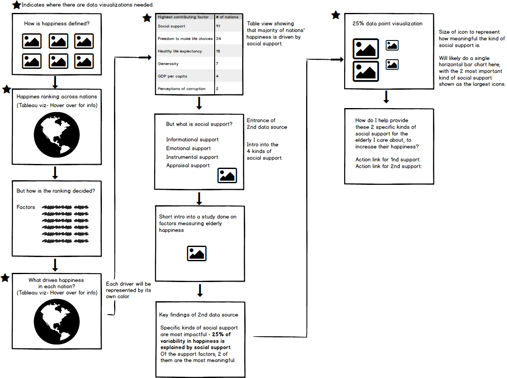

# Final Project Part II - Development from Part I
The goal of this page is to flesh out the structure and necessary parts needed to execute my final project for Storytelling With Data. 

One of the biggest challenge coming from [Part I](https://eileenowang.github.io/final_project_eileenwang/) was that I thought there were many oppportunities to expand on and deepen the story around helping individuals find happiness, but I couldn't decide on an angle. With further research in the happiness domain, I finally decided to tell a story about how individuals could help equip elders they care about with the right resources to increase happiness, and why this is a meaningful action. To realize this story, I will be introducing a second data source into my final project.  

# Wireframes 

