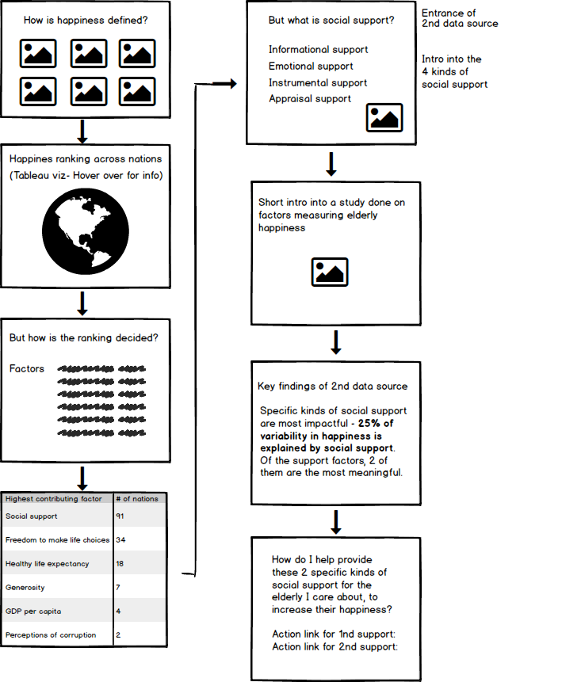

# Final Project Part II - Development from Part I
The goal of this page is to flesh out the structure and necessary parts needed to execute my final project for Storytelling With Data. 

One of the biggest challenge coming from [Part I](https://eileenowang.github.io/final_project_eileenwang/) was that I thought there were many oppportunities to expand on and deepen the story around helping individuals find happiness, but I couldn't decide on an angle. With further research in the happiness domain, I finally decided to tell a story about how individuals could help equip elders they care about with the right resources to increase happiness, and why this is a meaningful action. To realize this story, I will be introducing [a second data source](https://www.ncbi.nlm.nih.gov/pmc/articles/PMC6056407/) into my final project.  

# Storyboard / Wireframe 
Below, I have outlined how I will tell the story on [Shorthand](https://shorthand.com/). The key findings I want to illustrate in my storyboard are: 

1) Most nations saw social support as the primary driver of happiness. 

2) Within social support, there are 2 kinds of support- Informational Support and Emotional Support (will be defined in detail in final product) that are most impactful factors for happiness.  

3) It is found that 25% of variability in happiness is explained by social support, and this is something we can actively shape.

# My first storyboard:
This is what I used to showed individuals for gathering feedback in my user research. 

# Revised storyboard after collecting feedback from user research:
For information on the feedback that inspired the changes, please refer to the "Feedback from Users" section.

Here are also some data visualizations I've created for the first half of the storyboard: 

<noscript></noscript><object class='tableauViz'  style='display:none;'><param name='host_url' value='https%3A%2F%2Fpublic.tableau.com%2F' /> <param name='embed_code_version' value='3' /> <param name='site_root' value='' /><param name='name' value='Happinessworkbook_15818915524550&#47;Dashboard1' /><param name='tabs' value='no' /><param name='toolbar' value='yes' /><param name='static_image' value='https:&#47;&#47;public.tableau.com&#47;static&#47;images&#47;Ha&#47;Happinessworkbook_15818915524550&#47;Dashboard1&#47;1.png' /> <param name='animate_transition' value='yes' /><param name='display_static_image' value='yes' /><param name='display_spinner' value='yes' /><param name='display_overlay' value='yes' /><param name='display_count' value='yes' /><param name='filter' value='publish=yes' /></object>
                

# User research protocol 
*Target audience:* 
Individuals who have elderly people they care about. 

*Approach to identifying representative individuals to interview*
I plan on interviewing both my friends abroad and individuals on the CMU campus. I imagine most people would have elderly figures they care about, so it should not be too difficult to finding individuals that represent my target audience. 

*Interview script:*
Introduction: Many of us, no matter who we are or where we are, have elderly figures whom we care about. We might care about their happiness for different reasons - whether they are our grandparents or neighbors. Today, I'm looking to share a story about identifying the key factors that drive happiness, and especially those that are able to help the elderly people we know obtain happiness. My storytelling approach will be to go from general to specific, and end with actionable items to obtain happiness. To begin with, could you take a look at my storyboard (without me explaining further), and let me know: 

Questions:    
- Are you able to explain the flow of information to me?
- What conclusions were you able to draw from this? 
- Do you feel like the findings are relevant to my goal of helping pepleyou would be compelled to take action in the end? 

# Feedback from users
*Findings from your interviews* 
Feedback from User 1, a friend that lives in NY: 
- I think the subject is really interesting, could have so many approaches. I like how you first broke it down into 6 factors.  
- In addition to having a general map of the happiness ranking across countries, another visualization for what drives the happiness rank for each country would be really helpful. It would serve as an intermediate layer in the funnel to identify factors that contributes to happiness. 

Feedback from User 2, a CMU alumnus
- I think it's not immediately clear how the storyboard jumps from identifying the factors and then this chart with "highest contributing factor". I want to see a "big picture" view of the dataset here. 

Feedback from User 3, my classmate at CMU
- It might help to have some sort of visualization for the 25% data point. You said there are 2 social support types that account for 25% of variability in happiness, but I don't know what they are, and how they relate to the other social support types. 
- I've never thought of specifying the kind of support I can give my grandma. But after viewing this, it makes sense that I can be much more intentional than just giving her "grandson love". 

*Changes I implemented to my storyboars to address the issues identified.*
- Add a world map view where users can look at the driving factor of happiness for each nation. The map can be filtered by driving factor. 
- Add a data visualization to illustrate "25% of variability in happiness is explained by social support", where the 2 most important ones are informational support and emotional support. In my graph, I will draw out informational and emotional support to be proportionally bigger than the other social supporting factors. 
