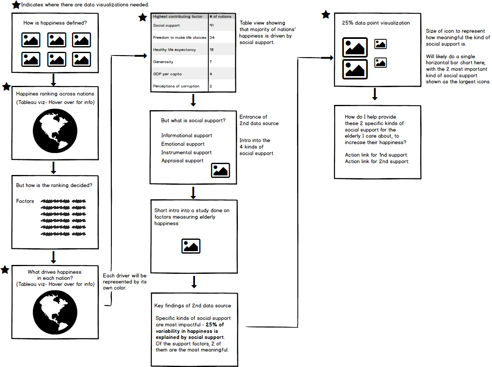

# Final Project Part II - Development from Part I
The goal of this page is to flesh out the structure and necessary parts needed to execute my final project for Storytelling With Data. 

One of the biggest challenge coming from [Part I](https://eileenowang.github.io/final_project_eileenwang/) was that I thought there were many oppportunities to expand on and deepen the story around helping individuals find happiness, but I couldn't decide on an angle. With further research in the happiness domain, I finally decided to tell a story about how individuals could help equip elders they care about with the right resources to increase happiness, and why this is a meaningful action. To realize this story, I will be introducing [a second data source](https://www.ncbi.nlm.nih.gov/pmc/articles/PMC6056407/) into my final project.  

# Storyboard / Wireframe 
Below, I have outlined how I will tell the story on Shorthand. The key findings I want to illustrate are: 1) Most nations saw social support as the primary driver of happiness. 2) Within social support, 2 kinds of support- Informational Support and Emotional Support (will be defined in final product) are the most impactful. 3) 25% of variability in happiness is explained by social support, and this is something we can actively shape. 

Here are also some data visualizations I've created for the first half of the storyboard: 

# User research protocol 
Target audience: Individuals who have elderly people they care about. 
